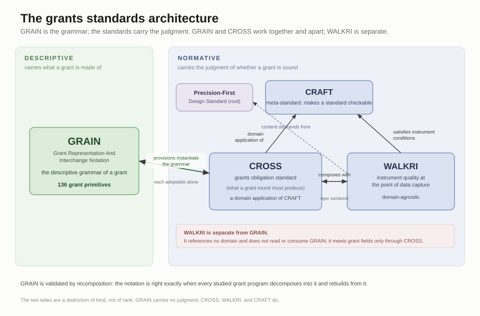

# GRAIN

**Grant Representation And Interchange Notation:** the descriptive grammar of a grant.

## What it is

GRAIN is the descriptive notation for grants: the grammar a grant program decomposes into and recomposes from, in one common, machine-readable form. It names the parts a grant is built from and carries no judgment of whether a grant is good or sound.

GRAIN is to CROSS as a grammar is to a usage rule. CROSS says what a grant round must produce; GRAIN names the parts that statement is built from. GRAIN and CROSS work together and apart: each is independently adoptable, and they compose. GRAIN is descriptive, not normative; it requires nothing of a program and gives the standards that read it a shared vocabulary for writing a grant.

## Where its building blocks come from

The pieces GRAIN names were not invented. Each was drawn from real funding programs across many traditions (philanthropic foundations, government and multilateral funders, impact investing, web3 rounds, humanitarian and evaluation bodies) and kept only if it appeared in more than one independent source, or carried as held-weak on a single source. A grant program comes apart into these pieces and rebuilds from them.

## Status

In preparation for publication. The notation is `GRAIN-notation-0_1_0.md`, holding 138 grant primitives across its grant-representation layers; the machine-readable layer and the publication pass follow.

## How it relates to the other standards

- **CRAFT**, the meta-standard for making a standard checkable: https://github.com/CrossWalkri/craft-meta-standard
- **CROSS**, the grants obligation standard, a domain application of CRAFT: https://github.com/CrossWalkri/CROSS. CROSS's grant provisions instantiate GRAIN's grammar; the two are each independently adoptable and compose.
- **WALKRI**, instrument quality at the point of data capture: https://github.com/CrossWalkri/WALKRI. WALKRI is separate and domain-agnostic; its content descends from the Precision-First Design Standard, and it reaches grant primitives only when a grants program composes it with CROSS.
- **GRAIN**, this repository, the grant notation the grants standards read.

The full index of the work is at https://github.com/durgadasji/standards-index

## License

Dedicated to the public domain under CC0. See the LICENSE file.
